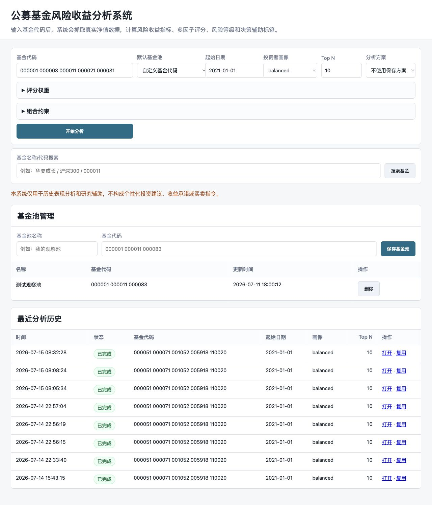
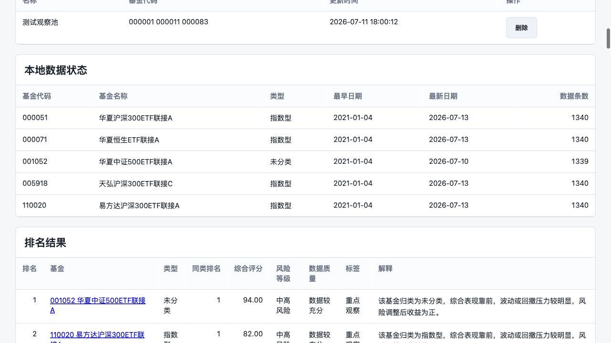
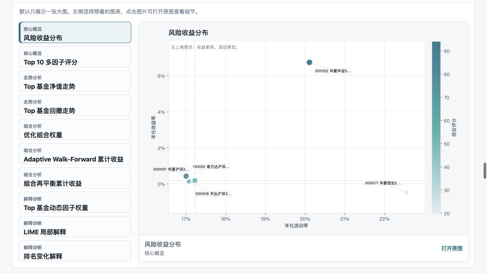

# 公募基金风险收益评价与量化筛选系统

[English README](README.md) · [更新日志](CHANGELOG.md) · [本地部署](docs/local_deployment.md) · [示例报告包](docs/sample_outputs/README.md) · [贡献指南](CONTRIBUTING.md)

本项目是一个基于 Python 的公募基金历史表现分析与决策辅助系统。项目目标不是简单按历史收益率排序，而是搭建一套可复现、可解释、可下载、可复用配置的基金风险收益研究工作台，回答一个更贴近数据分析的问题：

> 如果基金筛选不能只看收益率，如何从收益、风险、风险调整收益和稳定性多个维度评价基金？

这个仓库更适合作为一个完整的金融数据分析作品集项目：它不是单个 notebook，而是包含真实数据抓取、SQLite 缓存、Web 分析台、模型效果评估、数据质量诊断、策略回测基准、CSV/Markdown/Word/PDF/Excel 报告、图表、因子诊断和样本外验证的一套小型应用。

## 合规声明

本项目是基金历史表现分析与决策辅助系统，不构成个性化投资建议、收益承诺或买卖指令。系统输出的排名、风险等级和观察标签仅用于研究比较。实际投资需要结合投资者风险承受能力、投资期限、流动性需求、费用、基金合同和市场环境等因素。

## GitHub 展示亮点

- 首屏可以直接看到 Web 页面、排名结果和演示动图。
- 支持 macOS、Linux、Windows 和 Docker 本地部署。
- 使用 AkShare 抓取真实公募基金净值，不只依赖模拟数据。
- 用收益、波动、最大回撤、Sharpe、Calmar 和滚动胜率做多因子评分。
- 支持激进型、平衡型、稳健型三类投资者画像。
- 输出风险等级、观察标签、数据质量提示和自然语言解释。
- 包含 Walk-Forward 样本外验证、机器学习辅助评分、模型效果评估、数据质量诊断、策略回测基准、用户自定义权重/目标保存、基金级动态权重、组合构建、组合建议解释、集中度/相关性控制、组合再平衡回测、LIME 局部解释、Office/PDF 导出和权重稳健性分析。

## 功能概览

| 功能 | 说明 |
|---|---|
| 真实数据接入 | 通过 AkShare 抓取开放式基金单位净值和基金名称 |
| 多因子评分 | 计算收益、风险、风险调整收益和稳定性指标 |
| 投资者画像 | 支持 aggressive、balanced、conservative 三类权重 |
| 敏感性分析 | 比较不同风险偏好下的基金排名变化 |
| 决策辅助标签 | 输出风险等级、观察标签和原因说明 |
| 基金类型分类 | 根据基金名称推断股票型、混合型、债券型、指数型等大类 |
| 数据质量提示 | 标记样本期较短、滚动窗口不足、波动率异常等问题 |
| 数据质量诊断 | 对净值完整率、缺失天数、最长断档、异常跳变和质量分给出诊断建议 |
| 结果解释 | 为每只基金生成自然语言解释，说明收益、风险和数据质量特点 |
| 基金池准入 | 按同类可比原则过滤基金，并对 A/C 份额做去重 |
| 基金池质量治理 | 对历史长度、净值完整率、异常跳变和疑似同策略重复产品打分提示 |
| 因子诊断 | 输出 Spearman 相关性矩阵，识别指标信息重叠 |
| 贡献分解 | 对线性加权评分做精确因子贡献解释 |
| LIME 局部解释 | 用局部扰动和加权线性代理模型解释单只基金附近的评分敏感因子 |
| 机器学习辅助评分 | 用 Walk-Forward 历史样本学习因子权重，并生成 ML 对照排名 |
| 模型效果评估 | 用 Rank IC、Top 命中率提升和未来收益提升检查 ML 是否优于原画像权重 |
| 基准与同类对比 | 对比 TopN 组合、基金池等权基准、可选外部基准和同类排名百分位 |
| 策略回测基准 | 汇总静态基准、Walk-Forward、动态权重验证和组合再平衡回测 |
| 组合构建 | 生成原始 TopN、动态权重 TopN、ML TopN、风险平价、回撤约束和用户约束优化组合 |
| 组合建议解释 | 解释每只基金为什么入选、为什么分配该权重，以及对应风险和分散化提示 |
| 组合约束配置 | 用户可配置组合目标、持仓数量、单只权重上限、同类占比上限、相关性阈值、回撤下限、Sharpe 下限、换手率和交易成本 |
| 集中度与相关性控制 | 输出同类型基金占比、最大单只权重和高相关基金对的风险控制明细 |
| 组合再平衡回测 | 滚动重排基金并比较固定、动态、约束优化、风险平价和全基金组合 |
| 解释可视化 | 输出动态权重、LIME 局部权重和排名变化图 |
| 动态权重验证 | 用 Walk-Forward 检验基金级动态权重是否有样本外区分能力 |
| 友好格式导出 | 生成 Word 综合报告、PDF 综合报告和 Excel 数据汇总 |
| 样本外验证 | 通过 Walk-Forward 检验高排名基金后续表现区分能力 |
| 权重稳健性 | 使用 Monte Carlo 权重扰动计算 TopK 入选频率和 Rank IQR |
| Web 分析台 | 输入代码即可分析，支持搜索、基金池、下载 |
| 基金详情页 | 查看单只基金指标、排名、动态权重、LIME 和因子贡献 |
| SQLite 缓存 | 保存净值、基金名称、基金池和分析历史 |
| 分析方案保存 | 保存用户自定义评分权重、组合目标和约束，下次可直接复用 |
| 独立结果页 | 每次分析保留独立报告，不被新结果覆盖 |
| 研究报告 | 生成轻量文本因子和可解释模型说明 |

## 页面预览







## 系统架构

```text
基金代码 / 基金池
      ↓
AkShare 数据抓取
      ↓
SQLite 本地缓存
      ↓
净值清洗与指标计算
      ↓
多因子评分和画像排名
      ↓
风险等级、敏感性分析、研究报告
      ↓
Web 页面、单图大图查看、Word/PDF/Excel 报告
```

## 文档索引

- [本地部署说明](docs/local_deployment.md)
- [示例报告包](docs/sample_outputs/README.md)
- [Web 演示说明](docs/demo_guide.md)
- [正式项目报告](docs/project_report.md)
- [100 只真实基金样本验证](docs/real_world_validation.md)

## 分析流程

系统会执行完整的数据分析闭环：

```text
选择基金代码或基金池
  -> 数据质量诊断和模型效果评估
  -> 原始、多因子动态权重、ML、组合结果对比
  -> 单张大图查看重点图表
  -> 导出 Word、PDF 和 Excel 报告
```

首页把评分权重和组合约束放进默认收起的高级设置里，新用户可以更快开始分析；需要调参时仍然可以展开配置、保存方案并复用。

多因子评分模型：

```text
Fund Score =
w1 * Annual Return
+ w2 * Sharpe Ratio
+ w3 * Maximum Drawdown
+ w4 * Calmar Ratio
+ w5 * Volatility
+ w6 * Rolling Positive Ratio
```

三类投资者画像：

| 画像 | 设计思路 |
|---|---|
| aggressive | 更看重收益和收益持续性，接受更高波动 |
| balanced | 平衡收益、回撤、风险调整收益和稳定性 |
| conservative | 更看重最大回撤、波动控制和持有体验 |

## 项目结构

```text
Fund-Ranking-System
├── data
│   ├── raw
│   └── processed
├── docs
│   ├── demo_guide.md
│   ├── local_deployment.md
│   └── project_report.md
├── reports
├── src
│   └── fund_ranking_system
│       ├── cli.py
│       ├── akshare_data.py
│       ├── advisory.py
│       ├── data.py
│       ├── metrics.py
│       ├── pipeline.py
│       ├── report.py
│       ├── research.py
│       ├── scoring.py
│       ├── sensitivity.py
│       ├── storage.py
│       ├── web.py
│       └── visualization.py
├── tests
├── scripts
│   ├── run_web.sh
│   ├── fetch_akshare_funds.py
│   └── update_fund_data.py
├── pyproject.toml
├── requirements.txt
└── README.md
```

## 快速运行

### GitHub 本地部署

macOS / Linux 克隆项目后，可以直接运行：

```bash
git clone <your-repo-url>
cd fund-ranking-system
bash scripts/run_web.sh
```

如果希望后台运行并保留日志，可以运行：

```bash
bash scripts/start_web.sh
tail -f tmp/fund-ranking-web.log
bash scripts/stop_web.sh
```

然后打开：

```text
http://127.0.0.1:8000
```

健康检查地址：

```text
http://127.0.0.1:8000/health
```

详细说明见：[本地部署说明](docs/local_deployment.md)。

Windows PowerShell 可以运行：

```powershell
git clone https://github.com/ZZJ1977/fund-ranking-system.git
cd fund-ranking-system
py -3.11 -m venv .venv
.\.venv\Scripts\python.exe -m pip install --upgrade pip
.\.venv\Scripts\python.exe -m pip install -e .
.\.venv\Scripts\fund-ranking-web.exe --host 127.0.0.1 --port 8000
```

然后浏览器打开：

```text
http://127.0.0.1:8000
```

### Docker 启动

如果本机已经安装 Docker，也可以直接运行：

```bash
git clone https://github.com/ZZJ1977/fund-ranking-system.git
cd fund-ranking-system
docker compose up --build
```

然后打开：

```text
http://127.0.0.1:8000
```

容器启动后可以通过 `docker compose ps` 查看健康状态。

### 命令行 demo

```bash
cd ~/fund-ranking-system
python3 -m venv .venv
source .venv/bin/activate
pip install -e . pytest
fund-ranking --demo --profile balanced
```

如果已经安装过依赖，可以直接运行：

```bash
.venv/bin/fund-ranking --demo --profile balanced
```

## 启动 Web 分析页面

本项目提供本地 Web 版，适合实际演示和日常查询。启动后可以在页面输入基金代码、起始日期和投资者画像，系统会自动抓取真实净值数据并生成排名、图表和报告。

```bash
cd ~/fund-ranking-system
.venv/bin/fund-ranking-web --host 127.0.0.1 --port 8000
```

打开：

```bash
open http://127.0.0.1:8000
```

页面仍然只提供历史表现分析和研究辅助，不构成个性化投资建议。

Web 页面支持：

- 分析时显示加载状态
- 页面内错误提示，不会直接白屏
- 按基金名称或代码搜索基金
- 使用默认基金池进行快速分析
- 下载 Markdown 报告、CSV 排名和指标明细
- 使用 SQLite 缓存历史净值，重复分析同一基金时优先读取本地数据
- 记录最近分析历史，方便回看分析过的基金组合
- 点击历史记录可打开独立结果页，也可以复用历史参数重新分析
- 支持自定义基金池保存和删除
- 显示本地缓存的最早日期、最新日期和数据条数
- 每次分析生成独立报告目录，历史报告不会被新结果覆盖
- 自动生成研究报告，包含轻量文本因子和可解释模型说明
- 自动生成 LIME 局部解释报告，展示单只基金附近的评分敏感因子
- 自动生成组合构建、组合再平衡回测、基准对比和解释可视化图表
- 支持在网页上配置组合约束，并在历史记录、下载文件和 Excel 汇总中保留参数
- 自动生成组合建议说明书，说明入选原因、权重原因、风险提示和分散化控制

## 本地数据库与自动更新

Web 版会自动维护一个本地 SQLite 数据库：

```text
data/fund_ranking.db
```

数据库保存：

- 基金代码和名称
- 历史单位净值
- 最近分析记录

如果某只基金已经缓存过，页面会显示类似：

```text
缓存命中 3 只，远程补抓 0 只。
```

也可以手动更新数据库中已有基金：

```bash
cd ~/fund-ranking-system
.venv/bin/python scripts/update_fund_data.py --start-date 2021-01-01
```

指定基金更新：

```bash
.venv/bin/python scripts/update_fund_data.py --codes 000001 000011 000083 --start-date 2021-01-01
```

## 输出结果

可直接预览的示例输出：

- 示例说明：[docs/sample_outputs](docs/sample_outputs/README.md)
- Word 综合报告：[analysis_reports.docx](docs/sample_outputs/analysis_reports.docx)
- PDF 综合报告：[analysis_reports.pdf](docs/sample_outputs/analysis_reports.pdf)
- Excel 数据汇总：[analysis_data.xlsx](docs/sample_outputs/analysis_data.xlsx)
运行后会生成：

- `data/raw/demo_fund_nav.csv`：模拟基金净值数据
- `data/raw/fund_metadata.csv`：基金代码、基金简称映射表
- `data/processed/fund_metrics.csv`：收益率、波动率、回撤、Sharpe、Calmar 等指标
- `data/processed/ranking_all_profiles.csv`：三类投资者画像的评分和排名
- `reports/ranking_aggressive.csv`：激进型投资者排名
- `reports/ranking_balanced.csv`：平衡型投资者排名
- `reports/ranking_conservative.csv`：稳健型投资者排名
- `reports/weight_sensitivity.csv`：权重敏感性分析结果
- `reports/weight_sensitivity.md`：权重敏感性分析摘要
- `reports/fund_universe.md`：基金池准入报告
- `reports/data_quality_diagnostics.md`：数据质量诊断报告
- `reports/data_quality_diagnostics.csv`：数据质量诊断明细
- `reports/factor_diagnostics.md`：因子相关性诊断
- `reports/factor_contributions.md`：因子贡献解释
- `reports/lime_explanations.md`：LIME 局部解释报告
- `reports/lime_explanations.csv`：LIME 局部解释明细
- `reports/adaptive_weight_report.md`：基金级动态权重报告
- `reports/adaptive_factor_weights.csv`：每只基金的动态因子权重
- `reports/ranking_adaptive_<profile>.csv`：动态权重排名
- `reports/benchmark_comparison.md`：基准组合与同类对比报告
- `reports/benchmark_comparison.csv`：TopN 组合与基金池等权基准对比
- `reports/peer_comparison_<profile>.csv`：基金池排名、同类排名和百分位
- `reports/portfolio_construction.md`：组合构建报告
- `reports/portfolio_summary.csv`：组合历史风险收益摘要
- `reports/portfolio_weights_<profile>.csv`：组合持仓权重
- `reports/portfolio_constraints.csv`：组合约束配置
- `reports/portfolio_recommendation.md`：组合建议说明书
- `reports/portfolio_recommendations.csv`：组合建议解释明细
- `reports/portfolio_risk_controls.csv`：集中度与相关性控制明细
- `reports/portfolio_optimized_weights.png`：约束优化组合权重图
- `reports/portfolio_rebalance_report.md`：组合再平衡回测报告
- `reports/portfolio_rebalance_results.csv`：组合再平衡结果
- `reports/portfolio_rebalance_periods.csv`：组合再平衡窗口明细
- `reports/portfolio_rebalance_cumulative_return.png`：组合再平衡累计收益图
- `reports/adaptive_backtest_summary.md`：动态权重 Walk-Forward 验证报告
- `reports/adaptive_walk_forward_results.csv`：动态权重验证结果
- `reports/dynamic_weight_top_factors.png`：动态因子权重图
- `reports/lime_local_weight_bars.png`：LIME 局部权重图
- `reports/rank_comparison_changes.png`：原始排名与 ML 排名变化图
- `reports/ml_model_report.md`：机器学习辅助评分报告
- `reports/ml_evaluation.md`：模型效果评估报告
- `reports/ml_evaluation.csv`：模型效果评估明细
- `reports/ml_learned_weights.csv`：机器学习学习权重
- `reports/ranking_ml_<profile>.csv`：机器学习辅助排名
- `reports/ml_training_samples.csv`：机器学习训练样本
- `reports/ranking_comparison_<profile>.csv`：原始排名与 ML 排名对比
- `reports/ranking_comparison.md`：原始排名与 ML 排名对比报告
- `reports/weight_robustness.md`：权重扰动稳健性分析
- `reports/strategy_benchmark.md`：策略回测基准对比报告
- `reports/strategy_benchmark.csv`：策略回测基准明细
- `reports/backtest_summary.md`：Walk-Forward 样本外验证报告
- `reports/fund_analysis_report.md`：中文项目分析报告
- `reports/analysis_reports.docx`：Word 综合报告
- `reports/analysis_reports.pdf`：PDF 综合报告
- `reports/analysis_data.xlsx`：Excel 数据汇总
- `reports/*.png`：风险收益散点图、净值走势、回撤曲线和 Top 排名图

排名表中还会输出：

- `risk_level`：较低风险、中等风险、中高风险、高风险
- `fund_type`：推断出的基金类型
- `type_rank`：同类基金内排名
- `data_quality`：数据质量提示
- `quality_score`：基金池质量分，综合历史长度、净值完整率和异常跳变
- `decision_label`：重点观察、可观察、高回撤预警、暂不优先
- `decision_reason`：系统给出该标签的历史指标原因
- `result_explanation`：自然语言解释

## 100 只真实样本验证

项目已完成一次 100 只真实股票型 / 混合型基金候选池测试。经过基金池准入后，55 只基金纳入分析。

Walk-Forward 样本外验证结果：

| Portfolio | Annual Return | Sharpe | Volatility | Max Drawdown | Win Rate |
|---|---:|---:|---:|---:|---:|
| Top 10 | -2.29% | -0.11 | 21.59% | -33.51% | 47.2% |
| Top 20% | -3.26% | -0.15 | 21.35% | -35.33% | 47.6% |
| All Funds | -5.51% | -0.25 | 21.94% | -39.77% | 45.4% |

该结果说明：在这组真实样本和参数设定下，模型 Top 组合相对全基金等权组合表现出更好的风险收益特征。但它不证明模型可以预测未来收益，也不构成投资建议。

详细结果见：[100 只真实基金样本验证](docs/real_world_validation.md)。

## 使用自己的数据

准备一个 CSV，第一列为日期，后面每一列是一只基金的单位净值或复权净值：

```csv
Date,Fund_A,Fund_B,Fund_C
2023-01-03,1.0000,1.0000,1.0000
2023-01-04,1.0021,0.9987,1.0032
2023-01-05,1.0045,1.0018,1.0011
```

运行：

```bash
.venv/bin/fund-ranking --input data/raw/your_fund_nav.csv --profile balanced
```

如果有沪深300、中证偏股基金指数等外部基准净值，也可以一起接入：

```bash
.venv/bin/fund-ranking --input data/raw/your_fund_nav.csv --benchmark data/raw/benchmark_nav.csv --profile balanced
```

命令行也可以运行带约束的组合优化：

```bash
.venv/bin/fund-ranking --input data/raw/your_fund_nav.csv --profile balanced \
  --portfolio-objective defensive \
  --portfolio-min-funds 4 \
  --portfolio-max-funds 8 \
  --max-position-weight 0.25 \
  --max-type-weight 0.55 \
  --max-pair-correlation 0.85 \
  --portfolio-max-drawdown -0.35 \
  --portfolio-min-sharpe 0.1 \
  --rebalance-days 63 \
  --max-turnover 0.4 \
  --transaction-cost-bps 8
```

## 接入真实基金数据

项目提供了 AkShare 抓取脚本，可以从东方财富基金接口获取开放式基金单位净值走势，并整理成项目需要的宽表 CSV。

安装依赖：

```bash
.venv/bin/python -m pip install -e .
```

抓取默认 10 只基金的真实净值数据：

```bash
.venv/bin/python scripts/fetch_akshare_funds.py \
  --start-date 2021-01-01 \
  --output data/raw/real_fund_nav.csv \
  --metadata-output data/raw/fund_metadata.csv
```

使用真实数据运行评分系统：

```bash
.venv/bin/fund-ranking \
  --input data/raw/real_fund_nav.csv \
  --metadata data/raw/fund_metadata.csv \
  --profile balanced
```

也可以指定自己的基金代码：

```bash
.venv/bin/python scripts/fetch_akshare_funds.py \
  --codes 000001 000003 000011 000021 000031 \
  --start-date 2021-01-01 \
  --output data/raw/real_fund_nav.csv \
  --metadata-output data/raw/fund_metadata.csv
```

一组更适合展示的 30 只基金样例：

```text
110022 005827 001938 003096 161725 270042 001052 519674 001714 000988
002001 000991 519732 260108 163406 160222 162605 000248 001475 001410
004851 005669 006327 007119 008086 009341 010347 011011 012414 013356
```

抓取这组样例：

```bash
.venv/bin/python scripts/fetch_akshare_funds.py \
  --codes 110022 005827 001938 003096 161725 270042 001052 519674 001714 000988 002001 000991 519732 260108 163406 160222 162605 000248 001475 001410 004851 005669 006327 007119 008086 009341 010347 011011 012414 013356 \
  --start-date 2021-01-01 \
  --output data/raw/real_fund_nav.csv \
  --metadata-output data/raw/fund_metadata.csv
```

真实数据接口可能受网络、数据源限流或字段变更影响。如果某只基金抓取失败，脚本会跳过该基金并继续处理其他基金。

## 指标说明

| 指标 | 含义 |
|---|---|
| Annual Return | 年化收益率，衡量长期收益能力 |
| Volatility | 年化波动率，衡量收益波动程度 |
| Maximum Drawdown | 最大回撤，衡量历史最大亏损幅度 |
| Sharpe Ratio | 单位波动承担下获得的超额收益 |
| Calmar Ratio | 年化收益相对于最大回撤的表现 |
| Rolling Positive Ratio | 60 日滚动收益为正的比例，衡量稳定性 |

## 适合人群

- 想做金融科技、数据分析或量化研究作品集的学生。
- 想学习 Python 数据清洗、指标计算、可视化和 Web 展示闭环的初学者。
- 想了解基金风险收益评价、权重敏感性分析和样本外验证的量化入门用户。
- 想快速查看项目工程组织能力的面试官或评审者。

## 后续路线

- 增加定时任务，自动更新已保存基金池的净值数据。
- 引入更多基金元数据，例如基金经理年限、规模、费用率和持仓信息。
- 增强回测模块，加入基准指数和更严格的再平衡规则。
- 如果对外部署，增加登录认证、限流、日志、HTTPS 和合规免责声明。
- 增加 CI 检查，包括测试、格式化和文档链接校验。

## 验证

```bash
.venv/bin/python -m pytest -q
```

## License

This project is licensed under the [MIT License](LICENSE).
